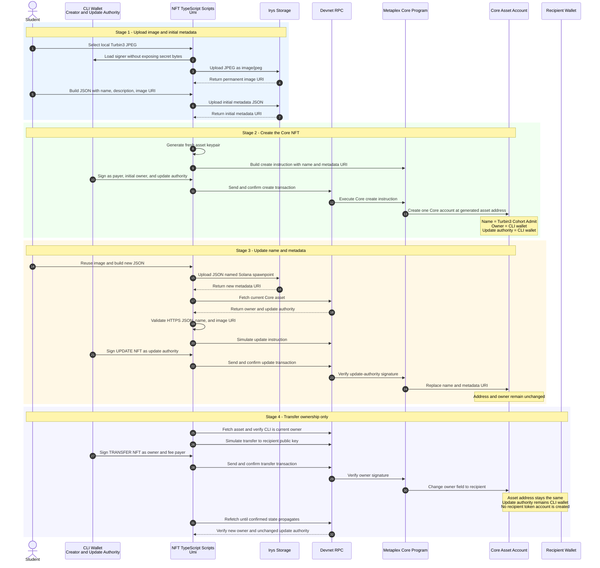
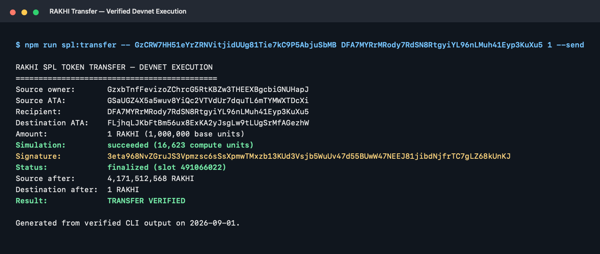
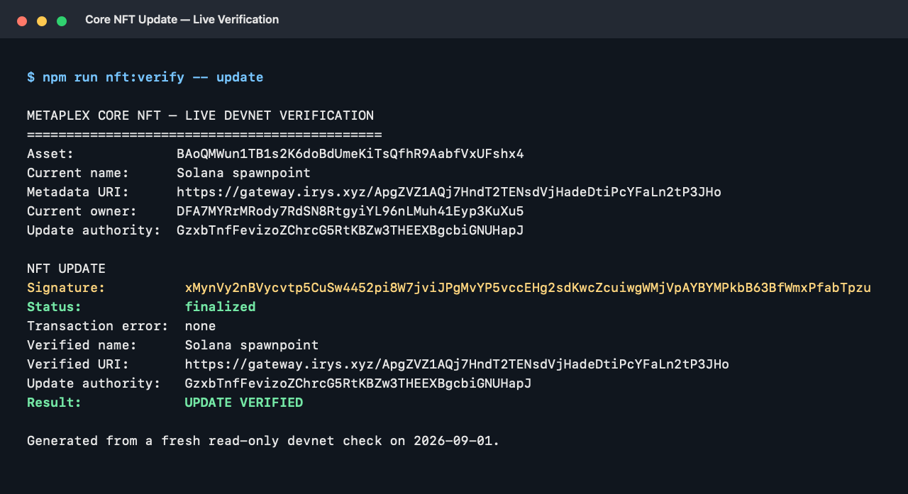
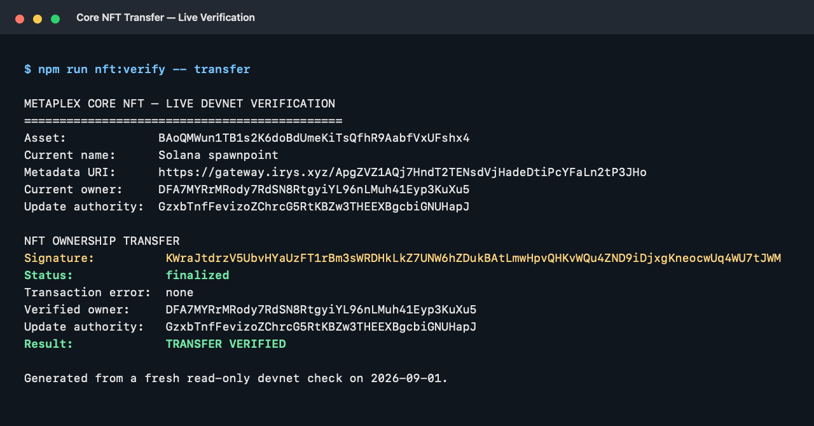

# Rakhi SPL Token and Metaplex Core NFT

This repository documents my work for the Turbin3 Q3 2026 Builders Cohort SPL token and NFT assignment on **Solana devnet**. It contains two related projects:

1. **Rakhi (`RAKHI`)** — a fixed-supply fungible token created with the original SPL Token Program.
2. **Solana spawnpoint** — an uncompressed NFT created with Metaplex Core, updated by its update authority, and transferred to a second wallet.

The emphasis is not only on getting successful transactions. The workflows make the relevant account roles, signers, authorities, simulation results, and post-transaction checks visible.

> This is an educational devnet project. The token and NFT have no promised monetary value. Never use the included workflow with a funded mainnet keypair without a separate security review.

## Assignment status

| Requirement | Status | Evidence |
|---|---|---|
| Mint an SPL token | Complete and verified | Fixed-supply mint transaction and live mint state |
| Transfer the SPL token | Complete and verified | One RAKHI transferred to the second devnet wallet |
| Mint an NFT using MPL Core | Complete and finalized | Core asset and creation transaction |
| Update NFT name and metadata as update authority | Complete and finalized | Update transaction and new Irys metadata URI |
| Transfer NFT ownership | Complete and finalized | Transfer transaction and verified new owner |
| Permanently burn the NFT and reclaim rent | Not implemented | Optional extension remains |
| Well-written README | Complete | This document |
| Terminal execution evidence | Included | See [Validation and terminal execution evidence](#validation-and-terminal-execution-evidence) |

The table deliberately distinguishes implemented code from finalized on-chain work. The NFT burn remains an optional extension; every other required on-chain operation listed above has a confirmed devnet transaction and a post-state verification.

## The two account models

The fungible token and Core NFT use different ownership models:

| Concept | Rakhi SPL token | Metaplex Core NFT |
|---|---|---|
| Main asset account | SPL mint account | Core asset account |
| How ownership is represented | Balances in token accounts/ATAs | `owner` field inside the Core asset |
| Recipient account | ATA derived from owner + mint + token program | No recipient token account required |
| Supply | `4,171,512,569` interchangeable tokens | One unique Core asset |
| Metadata | Token Metadata account points to off-chain JSON | Core asset URI points to off-chain JSON |
| Transfer effect | Decrease source balance and increase destination balance | Change the asset's `owner` field |
| Programmability | SPL Token instructions and authorities | Core plugins and authority model |

The Core asset in this repository is neither a Token Metadata programmable NFT (pNFT) nor a Bubblegum compressed NFT (cNFT). It is an **uncompressed Metaplex Core asset with its own Solana account**.

---

## Project 1: Rakhi fixed-supply SPL token


Rakhi turns the thread tied during Raksha Bandhan into an on-chain symbol: one `RAKHI` for every projected male in the world in 2026.

### Token properties

| Property | Value |
|---|---|
| Name | Rakhi |
| Symbol | `RAKHI` |
| Cluster | Solana devnet |
| Token program | Original SPL Token Program |
| Decimals | `6` |
| Whole-token supply | `4,171,512,569 RAKHI` |
| Base-unit supply | `4,171,512,569,000,000` |
| Initial holder | Creator's Associated Token Account (ATA) |
| Mint authority after issuance | None — permanently revoked |
| Freeze authority | None |
| Metadata standard | Metaplex Token Metadata |
| Metadata mutability | Mutable by the retained metadata update authority |

### Why this supply?

The supply uses the 2026 worldwide male-population projection derived from the United Nations DESA Population Division's *World Population Prospects 2024* medium variant:

```text
2026 projected world population:   8,300,678,399
2026 projected male population:    4,171,512,569
2026 projected female population:  4,129,165,830
```

The figure is a dated demographic projection, not a live count. The population presentation is available from [PopulationPyramids.org](https://www.populationpyramid.org/), and the underlying projection source is the UN [World Population Prospects data portal](https://population.un.org/wpp/).

### Why the supply is fixed

The final issuance transaction was intentionally atomic. It contained three instructions:

1. Create the creator's ATA if it did not already exist.
2. Mint the complete `4,171,512,569 RAKHI` supply into that ATA.
3. Set the mint authority to `None`.

If any instruction had failed, the entire transaction would have rolled back. Because it succeeded, the complete supply was created and no wallet can mint additional RAKHI. Revoking mint authority does not prevent existing tokens from being transferred or burned.

### Rakhi sequence diagram

The final section shows the verified transfer of one whole RAKHI to the second devnet wallet.

```mermaid
sequenceDiagram
    autonumber
    actor Student
    participant CLI as CLI Wallet
    participant SDK as TypeScript Scripts<br/>Kit and Umi
    participant RPC as Devnet RPC
    participant SYS as System Program
    participant SPL as SPL Token Program
    participant MPL as Token Metadata Program
    participant ATA as Token Accounts

    rect rgb(235, 245, 255)
        Note over Student,SPL: Stage 1 - Create the mint
        Student->>SDK: Preview spl:init, then approve --send
        SDK->>CLI: Show mint, payer, decimals, freeze authority
        SDK->>RPC: Simulate unsigned transaction
        CLI->>SDK: Sign CREATE RAKHI MINT
        SDK->>RPC: Submit signed transaction
        RPC->>SYS: Create rent-exempt mint account
        RPC->>SPL: Initialize mint with 6 decimals
        Note over SPL: Mint authority = CLI wallet<br/>Freeze authority = None
    end

    rect rgb(240, 255, 240)
        Note over Student,MPL: Stage 2 - Attach token metadata
        Student->>SDK: Provide mint address to spl:metadata
        SDK->>MPL: Build mutable metadata account
        Note over MPL: Name = Rakhi<br/>Symbol = RAKHI<br/>URI = public JSON
        SDK->>RPC: Simulate with replacement blockhash
        CLI->>SDK: Sign CREATE RAKHI METADATA
        SDK->>RPC: Submit and confirm metadata transaction
    end

    rect rgb(255, 248, 230)
        Note over Student,ATA: Stage 3 - Atomic fixed-supply issuance
        SDK->>ATA: Derive creator ATA from owner and mint
        SDK->>RPC: Simulate create ATA + mint + revoke authority
        CLI->>SDK: Sign MINT 4171512569 RAKHI
        SDK->>RPC: Submit one atomic transaction
        RPC->>ATA: Create creator ATA idempotently
        RPC->>SPL: Mint 4,171,512,569 RAKHI to creator ATA
        RPC->>SPL: Set mint authority to None
        Note over SPL,ATA: Supply is fixed; creator ATA receives full supply
    end

    rect rgb(245, 245, 255)
        Note over Student,ATA: Stage 4 - Read-only verification
        Student->>SDK: Run spl:verify
        SDK->>RPC: Fetch mint and creator ATA
        RPC-->>SDK: Supply, decimals, balances, authorities, owners
        SDK-->>Student: Verify exact supply and revoked authorities
    end

    rect rgb(255, 240, 240)
        Note over Student,ATA: Stage 5 - Transfer one RAKHI
        Student->>SDK: Provide mint, recipient, and amount = 1
        SDK->>ATA: Derive source and destination ATAs
        SDK->>RPC: Fetch balances and simulate unsigned transaction
        CLI->>SDK: Sign SEND RAKHI TRANSFER
        SDK->>RPC: Submit one atomic transaction
        RPC->>ATA: Create recipient ATA idempotently
        RPC->>SPL: TransferChecked 1 RAKHI
        SDK->>RPC: Refetch both token accounts
        RPC-->>SDK: Source = 4,171,512,568; destination = 1
        SDK-->>Student: Verify exact balance changes
    end
```

### Rakhi devnet evidence

Deployment was completed and independently verified on 28 August 2026. One RAKHI was transferred and both resulting balances were verified on 1 September 2026.

| Item | Devnet evidence |
|---|---|
| Creator wallet | [`GzxbTnfFevizoZChrcG5RtKBZw3THEEXBgcbiGNUHapJ`](https://explorer.solana.com/address/GzxbTnfFevizoZChrcG5RtKBZw3THEEXBgcbiGNUHapJ?cluster=devnet) |
| Mint | [`GzCRW7HH51eYrZRNVitjidUUg81Tie7kC9P5AbjuSbMB`](https://explorer.solana.com/address/GzCRW7HH51eYrZRNVitjidUUg81Tie7kC9P5AbjuSbMB?cluster=devnet) |
| Creator ATA | [`GSaUGZ4X5a5wuv8YiQc2VTVdUr7dquTL6mTYMWXTDcXi`](https://explorer.solana.com/address/GSaUGZ4X5a5wuv8YiQc2VTVdUr7dquTL6mTYMWXTDcXi?cluster=devnet) |
| Recipient wallet | [`DFA7MYRrMRody7RdSN8RtgyiYL96nLMuh41Eyp3KuXu5`](https://explorer.solana.com/address/DFA7MYRrMRody7RdSN8RtgyiYL96nLMuh41Eyp3KuXu5?cluster=devnet) |
| Recipient ATA | [`FLjhqLJKbFtBm56ux8ExKA2yJsgLw9tLUgSrMfAGezhW`](https://explorer.solana.com/address/FLjhqLJKbFtBm56ux8ExKA2yJsgLw9tLUgSrMfAGezhW?cluster=devnet) |
| Token Metadata account | [`DY72osnMtQf7r3mea1qcU9a5JG5nkn4CdpRJnoXg49WU`](https://explorer.solana.com/address/DY72osnMtQf7r3mea1qcU9a5JG5nkn4CdpRJnoXg49WU?cluster=devnet) |
| Mint initialization | [`4LLUVyUyMvxAT3MkiiSgkgrJwMf8gU3dUBk6dEXJvVV3GhLnkpH96xwbzxYAeNavXkNL5camFSRhMeYbdLpPj8zE`](https://explorer.solana.com/tx/4LLUVyUyMvxAT3MkiiSgkgrJwMf8gU3dUBk6dEXJvVV3GhLnkpH96xwbzxYAeNavXkNL5camFSRhMeYbdLpPj8zE?cluster=devnet) |
| Metadata creation | [`2u68L9SQyW1EvjVCG4RtB6YeTcQoSNHhacUT1d8V5reYcVnFfkPqdKAi4x6y3nibWxB71oTc6HYXZ2UFMYa54DKp`](https://explorer.solana.com/tx/2u68L9SQyW1EvjVCG4RtB6YeTcQoSNHhacUT1d8V5reYcVnFfkPqdKAi4x6y3nibWxB71oTc6HYXZ2UFMYa54DKp?cluster=devnet) |
| Fixed-supply issuance | [`3uektXNM1sEZ27SgR92brsdqa4CaJkqL4szKQSw61WpzLxPTqyMMBKsRq3BM7bo567qq57Cjr3TmL2cWHM1UgoX1`](https://explorer.solana.com/tx/3uektXNM1sEZ27SgR92brsdqa4CaJkqL4szKQSw61WpzLxPTqyMMBKsRq3BM7bo567qq57Cjr3TmL2cWHM1UgoX1?cluster=devnet) |
| One-RAKHI transfer | [`3eta968NvZGruJS3Vpmzsc6sSsXpmwTMxzb13KUd3Vsjb5WuUv47d55BUwW47NEEJ81jibdNjfrTC7gLZ68kUnKJ`](https://explorer.solana.com/tx/3eta968NvZGruJS3Vpmzsc6sSsXpmwTMxzb13KUd3Vsjb5WuUv47d55BUwW47NEEJ81jibdNjfrTC7gLZ68kUnKJ?cluster=devnet) |
| Current total supply | `4,171,512,569 RAKHI` |
| Current creator balance | `4,171,512,568 RAKHI` |
| Current recipient balance | `1 RAKHI` |
| Mint authority | None |
| Freeze authority | None |

---

## Project 2: Solana spawnpoint Metaplex Core NFT

The NFT began as **Turbin3 Cohort Admit**, was renamed to **Solana spawnpoint**, and was then transferred from the CLI wallet to a second devnet wallet. Its asset address never changed.

### Why I chose the cohort-admission image

The NFT image is the header of the email confirming my admission to the Turbin3 Builders Cohort. I chose it because the admission marks a personal turning point: from this point onward, I can learn, build, and contribute meaningfully within the Solana ecosystem.

I wanted to preserve that milestone on devnet as a **Core memory**—both in the personal sense and as a reference to Metaplex Core. The asset is not meant to derive value from the email itself. It is a record of where this part of my Solana journey began. The uploaded crop contains no private application details; it shows only the admission header and coordinator's name.

The ownership, name, and metadata reference are preserved by the Core asset account. The actual image and JSON remain off-chain at their Irys URIs, so their continued display also depends on that storage remaining available.

### Current Core asset state

| Property | Current value |
|---|---|
| Standard | Metaplex Core asset |
| Cluster | Solana devnet |
| Asset address | `BAoQMWun1TB1s2K6doBdUmeKiTsQfhR9AabfVxUFshx4` |
| Name | `Solana spawnpoint` |
| Current owner | `DFA7MYRrMRody7RdSN8RtgyiYL96nLMuh41Eyp3KuXu5` |
| Update authority | `GzxbTnfFevizoZChrcG5RtKBZw3THEEXBgcbiGNUHapJ` |
| Image URI | `https://gateway.irys.xyz/9cZpvaBwooUErUMVjKVqQxrgAAHJVhLTJTZ3jf1XCwep` |
| Current metadata URI | `https://gateway.irys.xyz/ApgZVZ1AQj7HndT2TENsdVjHadeDtiPcYFaLn2tP3JHo` |

### On-chain versus off-chain data

The JPEG and extended JSON metadata are not stored inside the Core asset account:

```text
Core asset account on Solana
└── stores owner, name, metadata URI, update authority, and plugins
    └── metadata URI points to JSON uploaded through Irys
        └── JSON image field points to the uploaded JPEG
```

This keeps the on-chain account small while preserving verifiable ownership and authority rules on Solana.

### NFT lifecycle sequence diagram

All three on-chain stages in this diagram—creation, update, and transfer—were executed and finalized on devnet.

[Watch the explainer video for this NFT lifecycle diagram](https://drive.google.com/drive/folders/1p7J_XXeqwL0Sj0iw25jymp303y6s7xUu?usp=sharing)




### NFT devnet evidence

| Lifecycle event | Devnet evidence |
|---|---|
| Asset | [`BAoQMWun1TB1s2K6doBdUmeKiTsQfhR9AabfVxUFshx4`](https://explorer.solana.com/address/BAoQMWun1TB1s2K6doBdUmeKiTsQfhR9AabfVxUFshx4?cluster=devnet) |
| Original owner and retained update authority | [`GzxbTnfFevizoZChrcG5RtKBZw3THEEXBgcbiGNUHapJ`](https://explorer.solana.com/address/GzxbTnfFevizoZChrcG5RtKBZw3THEEXBgcbiGNUHapJ?cluster=devnet) |
| Current owner | [`DFA7MYRrMRody7RdSN8RtgyiYL96nLMuh41Eyp3KuXu5`](https://explorer.solana.com/address/DFA7MYRrMRody7RdSN8RtgyiYL96nLMuh41Eyp3KuXu5?cluster=devnet) |
| Image upload | [`9cZpvaB...1XCwep`](https://gateway.irys.xyz/9cZpvaBwooUErUMVjKVqQxrgAAHJVhLTJTZ3jf1XCwep) |
| Initial metadata | [`8JUVH1n...w8WSX`](https://gateway.irys.xyz/8JUVH1n2xyhZbx1ofFZM7SmzkNAtxiJUNae3KW9w8WSX) |
| Updated metadata | [`ApgZVZ1...P3JHo`](https://gateway.irys.xyz/ApgZVZ1AQj7HndT2TENsdVjHadeDtiPcYFaLn2tP3JHo) |
| Create transaction | [`efzp6SvAXcD6qw3STWQpTZxYJRRBzUwkv1ExyyWgKhmpV33aNFEwrZQwMCcN2MRyBrzUx51xRTwU3NVCTZxdg7d`](https://explorer.solana.com/tx/efzp6SvAXcD6qw3STWQpTZxYJRRBzUwkv1ExyyWgKhmpV33aNFEwrZQwMCcN2MRyBrzUx51xRTwU3NVCTZxdg7d?cluster=devnet) |
| Update transaction | [`xMynVy2nBVycvtp5CuSw4452pi8W7jviJPgMvYP5vccEHg2sdKwcZcuiwgWMjVpAYBYMPkbB63BfWmxPfabTpzu`](https://explorer.solana.com/tx/xMynVy2nBVycvtp5CuSw4452pi8W7jviJPgMvYP5vccEHg2sdKwcZcuiwgWMjVpAYBYMPkbB63BfWmxPfabTpzu?cluster=devnet) |
| Ownership-transfer transaction | [`KWraJtdrzV5UbvHYaUzFT1rBm3sWRDHkLkZ7UNW6hZDukBAtLmwHpvQHKvWQu4ZND9iDjxgKneocwUq4WU7tJWM`](https://explorer.solana.com/tx/KWraJtdrzV5UbvHYaUzFT1rBm3sWRDHkLkZ7UNW6hZDukBAtLmwHpvQHKvWQu4ZND9iDjxgKneocwUq4WU7tJWM?cluster=devnet) |

---

## Repository structure

```text
assets/
├── rakhi-token.png          # Rakhi artwork
├── rakhi-token.json         # Rakhi off-chain metadata
└── evidence/                # Verified terminal transcripts and PNG captures
src/
├── spl/
│   ├── config.ts            # Token constants and devnet configuration
│   ├── utils.ts             # Validation, CLI keypair loading, confirmations
│   ├── spl_init.ts          # Create and initialize SPL mint
│   ├── spl_metadata.ts      # Create Token Metadata account
│   ├── spl_mint.ts          # Mint full supply and revoke mint authority atomically
│   ├── spl_transfer.ts      # Create recipient ATA and transfer checked amount
│   └── spl_verify.ts        # Read-only invariant verification
└── nft/
    ├── Turbin3_cohort_admit.jpg
    ├── nft_image.ts         # Upload JPEG through Irys
    ├── nft_metadata.ts      # Preview/upload Core JSON metadata
    ├── nft_mint.ts          # Create the Core asset
    ├── nft_update.ts        # Validate, simulate, update, and verify
    ├── nft_transfer.ts      # Simulate, transfer ownership, and verify authorities
    └── nft_verify.ts        # Read-only finalized transaction/state verification
```

## Setup

Requirements:

- Node.js 20.18 or newer
- npm
- Solana CLI configured for devnet
- A devnet-funded disposable keypair

```bash
npm install
npm run check
solana config get
```

By default, signing scripts load the Solana CLI keypair at `~/.config/solana/id.json`. An existing alternative can be selected without copying it into the repository:

```bash
export SOLANA_KEYPAIR_PATH="$HOME/.config/solana/id.json"
```

Never print, commit, or share the contents of a keypair JSON file. `devnet-wallet.json`, `*-wallet.json`, `.env*`, and build output are ignored by Git.

## Commands

### Rakhi token

```bash
# Preview, then create a new mint
npm run spl:init
npm run spl:init -- --send

# Preview, then create metadata for a mint
npm run spl:metadata -- <MINT_ADDRESS>
npm run spl:metadata -- <MINT_ADDRESS> --send

# Preview, then atomically mint full supply and revoke mint authority
npm run spl:mint -- <MINT_ADDRESS>
npm run spl:mint -- <MINT_ADDRESS> --send

# Read-only verification
npm run spl:verify -- <MINT_ADDRESS> <OWNER_ADDRESS>

# Preview a whole-token transfer; add --send only after review
npm run spl:transfer -- <MINT_ADDRESS> <RECIPIENT_ADDRESS> <AMOUNT>
npm run spl:transfer -- <MINT_ADDRESS> <RECIPIENT_ADDRESS> <AMOUNT> --send
```

### Core NFT

```bash
# Upload the configured JPEG through Irys
npm run nft:image

# Preview and then upload updated JSON metadata
npm run nft:metadata
npm run nft:metadata -- --upload

# Creating another asset generates a new Core NFT; do not rerun accidentally
npx ts-node src/nft/nft_mint.ts

# Simulate an update, then explicitly send after reviewing the summary
npm run nft:update -- <NEW_METADATA_URI>
npm run nft:update -- <NEW_METADATA_URI> --send

# Historical transfer workflow; it now refuses the CLI wallet because ownership moved
npm run nft:transfer
npm run nft:transfer -- --send

# Reproduce finalized update and transfer verification without a private key
npm run nft:verify -- update
npm run nft:verify -- transfer
```

The deployed NFT scripts contain assignment-specific asset and recipient addresses. Treat them as an auditable record of this devnet exercise, not as a general-purpose production CLI.

## Safety and authority model

- State-changing SPL scripts require `--send`; the transfer command builds and simulates first, while earlier lifecycle scripts provide a plan-only default.
- NFT update and transfer scripts fetch current state, validate authority, simulate unsigned transactions, display summaries, and require typed confirmation.
- Fresh blockhashes are obtained near signing to reduce expiry risk.
- Address and metadata inputs are validated before use.
- Post-transaction reads verify expected ownership, supply, and authority state.
- RPC reads may briefly lag confirmed writes, so NFT verification retries rather than blindly resending a transaction.
- The NFT recipient's private key is not needed to receive the asset; only its public key is placed in the transfer instruction.
- The recipient must control its private key to authorize a later transfer or burn.
- The CLI wallet retained NFT update authority after transferring ownership. It can update metadata but can no longer transfer the NFT as owner.
- Permanently burning the NFT would require the current owner's signature and is intentionally not implemented here.

## Validation and terminal execution evidence

The repository currently provides strict TypeScript validation:

```bash
npm run check
```

Expected result:

```text
> rakhi-token-q326@1.0.0 check
> tsc --noEmit
```

The following captures were generated from the exact verified CLI outputs preserved beside them as text transcripts. The RAKHI image records the current execution; the two NFT images are fresh read-only verification of the earlier finalized transactions and are labeled accordingly.

### RAKHI transfer execution



Raw transcript: [`rakhi-transfer-verification.txt`](assets/evidence/rakhi-transfer-verification.txt)

### NFT update verification



Raw transcript: [`nft-update-verification.txt`](assets/evidence/nft-update-verification.txt)

### NFT ownership-transfer verification



Raw transcript: [`nft-transfer-verification.txt`](assets/evidence/nft-transfer-verification.txt)

Original execution-time screenshots can also be added under `assets/evidence/` and embedded here. They should remain distinguishable from the later verification captures above.

This repository does not define an automated `test` script, so `npm run check` is correctly described as strict type-checking rather than as a test suite.

## What I learned

- A token mint defines a fungible asset, while ATAs hold wallet-specific balances.
- Fixed supply is an authority property, not merely a number in source code.
- Solana transaction atomicity can combine issuance and irreversible authority revocation safely.
- A Core NFT uses one asset account rather than an SPL mint plus token account.
- Image bytes, JSON metadata, and on-chain ownership are separate layers connected by URIs.
- Owner, update authority, payer, and recipient are distinct roles with different permissions.
- A successful transaction signature is evidence of execution; a separate state fetch proves the intended result.
- Simulation and explicit confirmation reduce risk, but post-transaction verification is still necessary.

## Acknowledgements

- Built for the [Turbin3](https://turbin3.com/) Q3 2026 Builders Cohort.
- Based on the cohort starter repository by [ShrinathNR](https://github.com/ShrinathNR/spl-nft-q326).
- Population source: United Nations DESA Population Division, *World Population Prospects 2024*.

---

Repository: [github.com/Chin-mae/rakhi-token-q326](https://github.com/Chin-mae/rakhi-token-q326)
